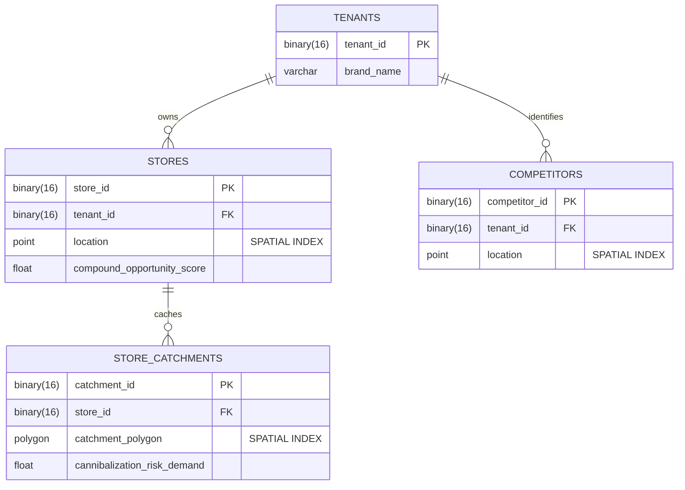

# TradeHalo Spatial Intelligence Engine

## 1. The Opportunity-Score Model
TradeHalo uses a **Hybrid Architecture** (Rule-Based + XGBoost Machine Learning) to score and rank potential store locations. 

The core philosophy of the engine is that retail success is a function of **Unmet Demand Capacity**. We evaluate 250 candidate locations across 58 variables split into 7 macro categories.

### Scoring Logic, Assumptions & Trade-Offs
* **Macro-Weight Justification:** The weights (Demand 25%, Competition 20%, Cannibalization 20%, etc.) were **heuristically asserted** based on retail real estate domain knowledge, aggressively biasing immediate spatial realities over speculative future signals. In a live production environment, these weights are meant to be empirically calibrated by running a regression against the brand's actual historical store revenue.
* **Normalization (Min-Max vs. Z-Score):** We chose Min-Max scaling to compress every metric strictly into a `[0, 1]` range. In a composite formula, unbounded variables (like Z-scores) can hijack the entire score. Min-Max ensures every metric stays strictly within its assigned weight bracket.
* **Operating Cost as a Divisor Penalty:** Instead of subtracting high operating costs (Rent, Labor), we applied Cost as a mathematical divisor. A hyper-premium location (like a luxury mall) shouldn't score zero just because it is expensive; by dividing, we compress its ROI margin without destroying its high-revenue potential.
* **Division-by-Zero Guardrails:** In edge cases (like DBSCAN White-Spaces) where demand or competition might equal exactly zero, the pipeline strictly enforces a `np.clip(denominator, 1, None)` ceiling constraint across all Python calculations to mathematically prevent zero-division `NaN` crashes in the Huff-style probability denominator.

## 2. The XGBoost Machine Learning Layer
While the Rule-Based engine relies on deterministic spatial decay logic (Huff Gravity) to calculate theoretical market share, retail economics are rarely linear. To capture nonlinear interactions, we introduced an `xgboost.XGBRegressor`.

* **The Synthetic Data Assumption:** To overcome the "cold start" problem, we synthesized 2,000 historical training records. *Limitation:* Synthetic distributions inherently carry the biases programmed into the generator script. In a live deployment, this synthetic layer must be entirely swapped out and the model retrained exclusively on the brand's real POS (Point of Sale) historical data.
* **The Features & Target:** The ML model analyzes 7 critical nonlinear variables (Rent, Demand, Proximity, etc.) to predict a **Historical Revenue Coefficient**—guessing if a location historically overperformed or underperformed the raw theoretical math.
* **Divergence Guardrails (The 80/20 Blend):** The final Opportunity Score blends the Rule-Based output (80%) and the ML output (20%). If the XGBoost model strongly disagrees with the mathematical rules, what happens? Because both outputs are strictly `min_max_scaled` to a `[0, 1]` floor/ceiling *prior* to blending, the ML model can only mathematically swing the final score by a maximum of 20% in either direction. It acts safely as an **"Intuition Modifier"** without completely overwriting auditable geographic logic.

## 3. High-Performance Spatial Architecture
Calculating $O(N \times M)$ distances between millions of demand points and thousands of stores will instantly crash a standard Python loop (RAM exhaustion). We solved this scaling problem across two layers:

* **Python Engine (cKDTree):** We converted spherical Lat/Lng coordinates into 3D Cartesian space ($X, Y, Z$) and built a `scipy.spatial.cKDTree`, reducing spatial catchment queries from $O(N^2)$ to **$O(\log N)$**.
* **MySQL 8.0 Deployment:** We designed a production DDL (`database/schema.sql`) enforcing `POINT SRID 4326` geographic data types and native `SPATIAL INDEX` extensions. This pushes the heavy `ST_Distance_Sphere` intersection math down into the database R-Tree.

### Database Schema (ERD)
The database uses a strict multi-tenant architecture, utilizing `BINARY(16)` UUIDs to minimize index size.

## 4. The Dashboard & Visualizations
The frontend (`frontend/script.js`) is built using Leaflet.js and Chart.js, designed to answer the core executive question: *"Why did the model pick this location?"*

* **Demand Heatmap:** Shows the raw distribution of customer weight.
* **Competitor & Existing Store Pins:** Displays exact locations of rivals to visually validate cannibalization.
* **SHAP Impacts Layer:** We extracted exact `pred_contribs` (SHAP values) from the XGBoost trees. The map pins change color/size based on *how much* demand/competition warped the AI prediction, turning the black box into an explainable model.
* **DBSCAN White-Space Polygons:** Glowing yellow clusters highlighting massive demand pockets >3km away from *any* existing store.
